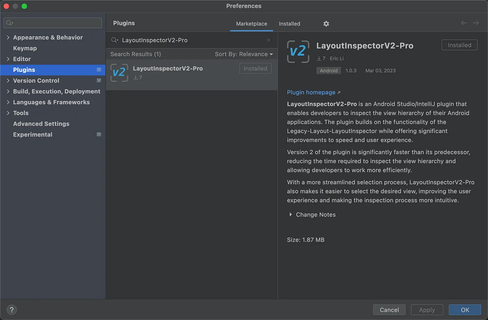
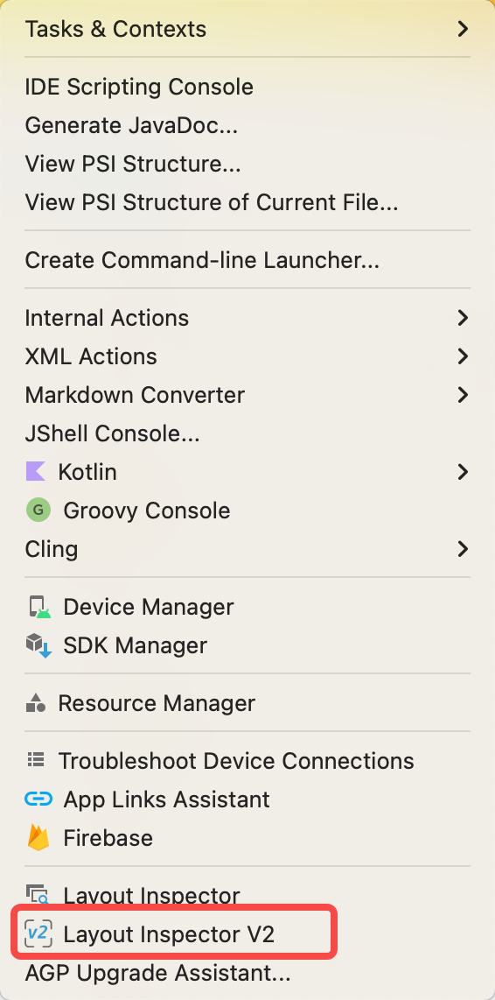
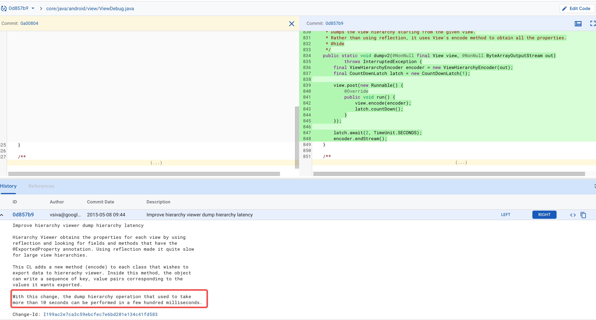
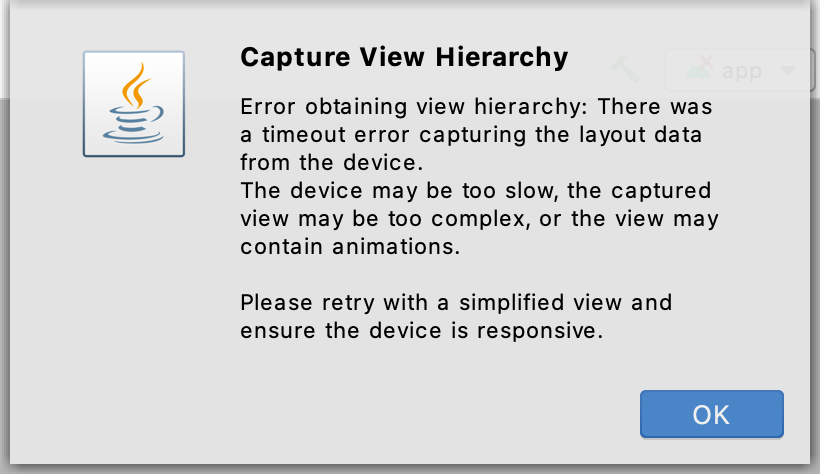
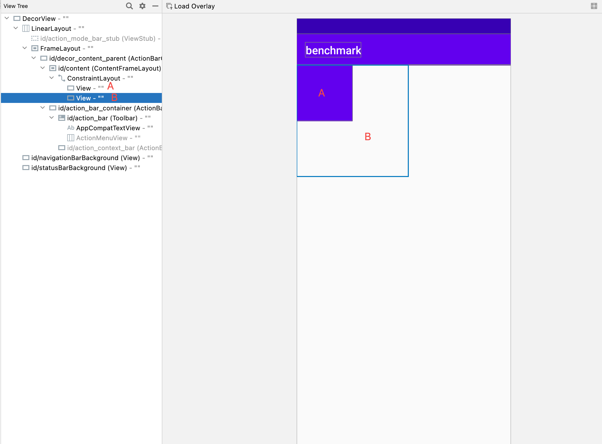

# LayoutInspectorV2-Pro
[![Version][badge:version]][plugin-versions]
[![Downloads][badge:downloads]][plugin-homepage]

[plugin-homepage]: https://plugins.jetbrains.com/plugin/21047-layoutinspectorv2-pro
[plugin-versions]: https://plugins.jetbrains.com/plugin/21047-layoutinspectorv2-pro/versions
[badge:version]: https://img.shields.io/jetbrains/plugin/v/21047.svg?style=flat-square&colorB=2196F3
[badge:downloads]: https://img.shields.io/jetbrains/plugin/d/21047.svg?style=flat-square&colorB=5C6BC0

LayoutInspectorV2-Pro is an Android Studio/Intellij plugin that allows Android developers to dump the view hierarchy. It is similar to the Legacy-Layout-LayoutInspector in some ways.

> For convenience, LegacyLayoutInspector is abbreviated as LLI.

## Installation
<kbd>Preferences(Settings)</kbd> > <kbd>Plugins</kbd> > <kbd>Marketplace</kbd> > <kbd>Search and find <b>"LayoutInspectorV2-Pro"</b></kbd> > <kbd>Install Plugin</kbd>

Restart the **IDE** after installation.

## Usage

You can find the plugin in the Tools menu.After the dump, LayoutInspectorV2-Pro generates a file with the `.liv2` extension, just like the `.li` file.

## Why Use LayoutInspectorV2-Pro?

The Google Android team removed the Legacy-LayoutInspector from Android Studio Bumblebee. If you are a fan of LLI, this plugin will be useful for you. Based on LLI, LayoutInspectorV2-Pro has made some improvements, including:

1. Faster dump speed
2. Easier selection of the view you want

The following section explains these improvements in detail.

### Dump Speed

LLI provides two ProtocolVersions: `ProtocolVersions.V1` and `ProtocolVersions.V2`. According to the [source code](https://cs.android.com/android/_/android/platform/frameworks/base/+/0d857b9028f2702ce439e13feccde8182d40e1e5), this feature was added in 2015.

LLI uses the V1 version by default to dump, but the V1 version is very slow. You may have seen a pop-up window warning of timeout.

Unfortunately, only internal Google engineers can use the V2 version. Therefore, LayoutInspectorV2-Pro uses the V2 version by default. I tested the dump speed of these two versions on my OnePlus 7 device with various numbers of views, and here are the results:

|                          | 3000 views | 4000 views | 5000 views |
|--------------------------|------------|------------|------------|
| ProtocolVersions.V1 (ms) | 4101       | 5352       | 6577       |
| ProtocolVersions.V2 (ms) | 625        | 724        | 837        |

### Easier selection

Many Android developers who use LLI may be confused by its default selection algorithm, which prioritizes the topmost view. However, in most cases, the sizes of areas should carry more weight when selecting a view.

Consider the following scenario: there are two views, A and B, and B is on top of A. If you click the A area in the image panel, LLI may not select A because B is larger and covers A.

With LayoutInspectorV2-Pro, the sizes of areas between A and B are compared, and A is selected because it is smaller than B. This approach ensures that the most appropriate view is selected.

## Supported Versions

LayoutInspectorV2-Pro should work with most Android Studio versions. The following Android Studio versions have been tested:

| Version                       | Build Number                |
|-------------------------------|-----------------------------|
| Bumblebee 2021.1.1            | 211.7628.21.2111.8092744    |
| Chipmunk 2021.2.1 Patch 2     | 212.5712.43.2112.8815526    |
| Dolphin 2021.3.1              | 213.7172.25.2113.9014738    |
| Electric Eel 2022.1.1 Patch 1 | 221.6008.13.2211.9514443    |
| Flamingo 2022.2.1 Canary 10   | 222.4459.24.2221.9409768    |
| Giraffe  2022.3.1 Canary 8    | 223.8617.56.2231.9687552    |
| Hedgehog 2023.1.1 Beta 5      | 231.9392.1.2311.10809438    |
| Iguana 2023.2.1 Canary 5      | 232.9921.47.2321.10840167   |
| Android Studio Jellyfish      | 233.13135.103.2331.11360849 |

If you encounter any issues in any version, please report them.

## Reporting Issues

If you encounter any issues while using LayoutInspectorV2-Pro, please report them by creating an issue in the project's issue tracker. To create an issue, please follow these steps:

1. Go to the [issue tracker](https://github.com/CoXier/LayoutInspectorV2-Pro/issues).
2. Click on the "New Issue" button.
3. Fill out the form with as much detail as possible.
4. Click on the "Submit new issue" button.

## Contributing

If you would like to contribute to this project, please follow these steps:

1. Fork the project.
2. Create a new branch.
3. Make your changes.
4. Submit a pull request.

## Show Your Support

If you find this project helpful, please consider giving it a star. Your support is greatly appreciated!

## License

This project is licensed under the Apache License 2.0. See the `LICENSE` file for more information.

